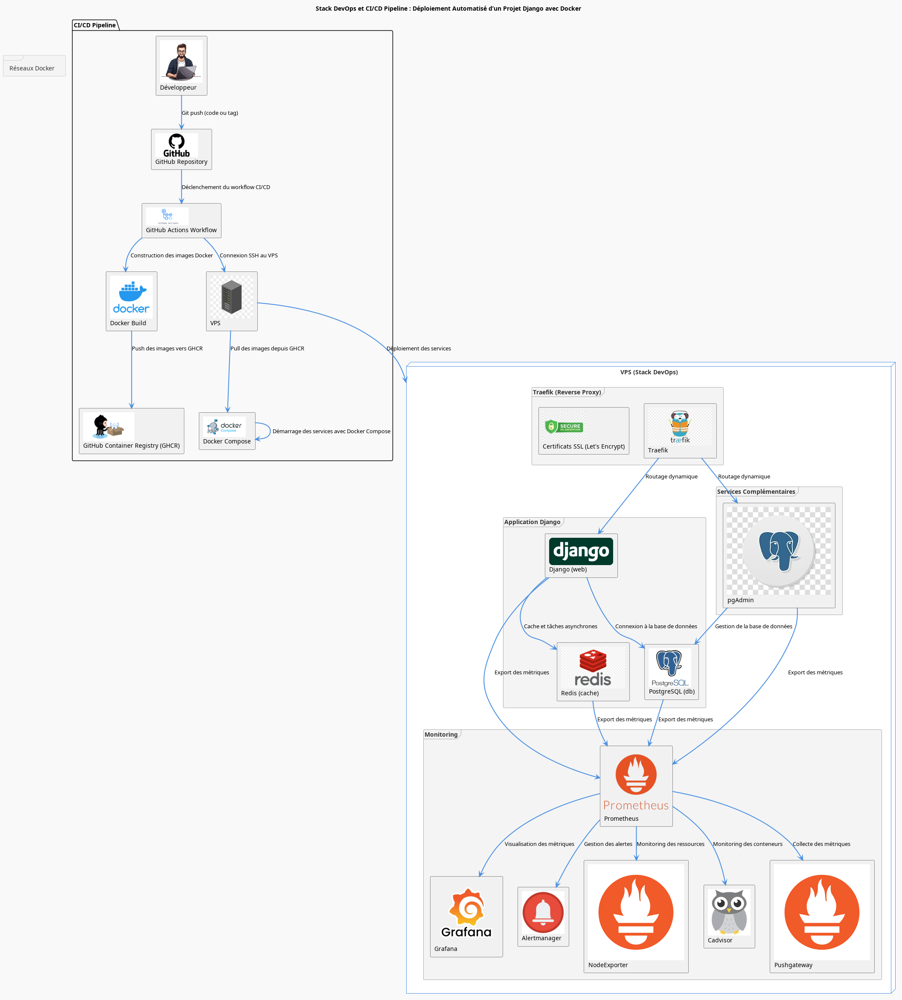

# 🚀 Stack DevOps : Déploiement Automatisé d’un Projet Django avec Docker

Ce dépôt contient une configuration complète pour déployer un projet **Django** avec des services complémentaires (**PostgreSQL**, **Redis**, **pgAdmin**, et **Traefik**) sur un **VPS Linux**. Le déploiement est automatisé grâce à **Docker**, **Docker Compose**, et **GitHub Actions** (CI/CD).

---

## 📋 Contenu du Projet

Le projet est organisé en plusieurs sous-dossiers, chacun ayant un rôle spécifique :

- **`web/`** : Contient l'application Django et sa configuration Docker.
- **`traefik/`** : Configure Traefik comme reverse proxy avec SSL et routage dynamique.
- **`redis/`** : Configure Redis pour le cache et les tâches asynchrones.
- **`pgadmin/`** : Fournit une interface web pour gérer la base de données PostgreSQL.

---

## 🖼️ Diagramme de la Stack

Voici une représentation visuelle de la stack DevOps :



---

## 🧰 Prérequis

Avant de commencer, assurez-vous d’avoir :

- Un VPS fonctionnel (Ubuntu recommandé).
- Un compte GitHub avec accès au dépôt.
- Docker et Docker Compose installés sur le VPS.
- Un tag Git valide dans votre dépôt Git (exemple : `v1.0.0`).

---

## 📂 Structure Générale

```
stack-dev/
├── web/                # Application Django
├── traefik/            # Configuration Traefik
├── redis/              # Configuration Redis
├── pgadmin/            # Configuration pgAdmin
└── README.md           # Documentation principale
```

---

## 🔐 Configuration des Secrets GitHub

Pour automatiser le déploiement, configurez les secrets GitHub dans **Settings > Secrets and variables > Actions** :

| Nom                   | Description                                                 |
| --------------------- | ----------------------------------------------------------- |
| `VPS_HOST`            | Adresse IP de votre VPS                                     |
| `VPS_PORT`            | Port SSH (par défaut : 22)                                  |
| `VPS_USERNAME`        | Utilisateur SSH (ex: `ubuntu`, `root`)                      |
| `VPS_SSH_PRIVATE_KEY` | Contenu de votre fichier `id_rsa_github`                    |
| `VPS_WORKDIR`         | Répertoire du projet sur le VPS                             |
| `ACCESS_TOKEN`        | Jeton GitHub (si vous utilisez GHCR pour les images Docker) |

---

## ⚙️ Installation sur le VPS

### 1. Installer Docker

Exécutez les commandes suivantes sur votre VPS :

```bash
sudo apt update
sudo apt install -y docker.io
sudo usermod -aG docker $USER
```

**⚠️ Déconnectez-vous/reconnectez-vous pour que le groupe Docker soit pris en compte.**

### 2. Installer Docker Compose

Méthode recommandée :

```bash
sudo apt install docker-compose-plugin
```

Ou installez manuellement :

```bash
DOCKER_CONFIG=${DOCKER_CONFIG:-$HOME/.docker}
mkdir -p $DOCKER_CONFIG/cli-plugins
curl -SL https://github.com/docker/compose/releases/download/v2.36.0/docker-compose-linux-x86_64 -o $DOCKER_CONFIG/cli-plugins/docker-compose
chmod +x $DOCKER_CONFIG/cli-plugins/docker-compose
docker compose version
```

---

## 🚀 Déploiement Automatisé avec GitHub Actions

Ce projet utilise **GitHub Actions** pour automatiser le déploiement sur votre VPS à chaque push ou création de tag sur la branche `main`.

### Fichier : `.github/workflows/ci-cd.yml`

Voici un aperçu du pipeline CI/CD :

```yaml
name: Django CI Pipeline

on:
  push:
    branches:
      - main
  pull_request:
    branches:
      - main

jobs:
  deploy:
    runs-on: ubuntu-latest
    steps:
      - name: Checkout code
        uses: actions/checkout@v4
        with:
          fetch-depth: 0

      - name: Log in to GitHub Container Registry
        uses: docker/login-action@v2
        with:
          registry: ghcr.io
          username: ${{ github.actor }}
          password: ${{ secrets.ACCESS_TOKEN }}

      - name: SSH to VPS and deploy
        uses: appleboy/ssh-action@v1.2.1
        with:
          host: ${{ secrets.VPS_HOST }}
          port: ${{ secrets.VPS_PORT }}
          username: ${{ secrets.VPS_USERNAME }}
          key: ${{ secrets.VPS_SSH_PRIVATE_KEY }}
          script: |
            cd ${{ secrets.VPS_WORKDIR }}
            git pull
            docker compose -f deploy-compose.yml up -d --build
```

---

## ✅ Utilisation

### 1. Pousser le code sur `main`

```bash
git add .
git commit -m "Votre message"
git push origin main
```

### 2. Créer un tag pour déclencher le déploiement

```bash
git tag v1.0.0
git push origin v1.0.0
```

---

## 📂 Détails des Sous-Dossiers

### 1. **`web/`** : Application Django

- Contient le code source de l'application Django.
- Inclut un `Dockerfile` et un fichier `compose.deploy.yml` pour orchestrer les services nécessaires (PostgreSQL, Redis, etc.).

### 2. **`traefik/`** : Reverse Proxy

- Configure Traefik pour gérer le routage dynamique et les certificats SSL via Let's Encrypt.
- Inclut un fichier `.htpasswd` pour protéger l'accès au tableau de bord.

### 3. **`redis/`** : Cache et Tâches Asynchrones

- Configure Redis pour le cache et les tâches asynchrones.
- Les données persistantes sont stockées dans le répertoire `data/`.

### 4. **`pgadmin/`** : Interface de Gestion PostgreSQL

- Fournit une interface web pour gérer la base de données PostgreSQL.
- Les identifiants par défaut sont configurés dans le fichier `.env`.

---

## 📬 Support

Si vous avez des questions ou des problèmes, n’hésitez pas à ouvrir une issue ou à me contacter.